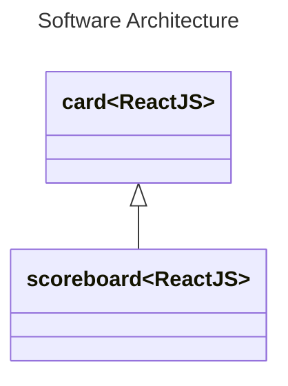
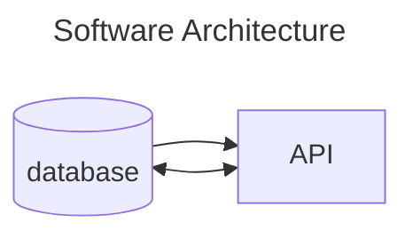

# theodinproject__memory_card
<a name="readme-top"></a>
<details>
    <summary>Table of Contents</summary>
    <ol>
        <li>
            <a href="#about-this">About This</a>
            <ul>
                <li><a href="#what">What</li>
                <li><a href="#why">Why</li>
                <li><a href="#how">How</li>
            </ul>
        </li>
        <li><a href="#roadmap">Roadmap</li>
        <li><a href="#acknowledgements">Acknowledgements</li>
    </ol>
</details>

## About This

The Odin Project: Memory Card Game

### What

Game that tests memory by asking users to remember already picked cards by picking different ones.

### Why

Test React knowledge.
Manage and utilize state while fetching and using data from an external API.

### How
#### Requirements
* Click Card
* Track Score
* Track Best Score
```mermaid
---
title: Event Loop
---
flowchart TD
    (Start) --> A[Wait]
    A --> B[Click]
    B --> C[UpdateScore]
    C -- New High Score --> D[UpdateMaxScore]
    B --> E[RefreshCards]
    E --> A
```
#### Design

#### Architecture
* Tech Stack
    * Frontend
        * React
        * ViteJS


## Roadmap
- [x] Create a new React Project.
- [ ] Take some time to think about the features you want to implement, which components you need, how to structure your application, and how to get the images from an API.
    - [ ] a scoreboard, which counts the current score, and a “Best Score”, which shows the highest score you’ve achieved thus far.
    - [ ] should display the cards in a random order anytime a user clicks one
- [ ] Style your application so you can show it off!
- [ ] As always, push the project to GitHub, and don’t forget to deploy it.

## Acknowledgements
* [The Odin Project](https://www.theodinproject.com/)
* [ViteJs](https://vitejs.dev)
<p align="right">(<a href="#readme-top">back to top </a>)</p>